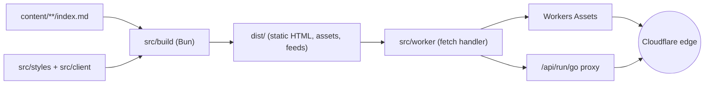

# albertbf.com

[](https://github.com/FumingPower3925/albertbf/actions/workflows/ci.yml)
[](https://github.com/FumingPower3925/albertbf/actions/workflows/deploy.yml)
[](LICENSE)

The source for [**albertbf.com**](https://albertbf.com) — a framework-free, zero-cost personal technical blog. A small Bun script turns Markdown into a static site with runnable code, syntax highlighting, math, and diagrams; a thin Cloudflare Worker serves it from the edge.

<!-- USER ACTION: add a light/dark screenshot here once the preview is live -->

## Features

- **Custom static generator** — ~1k lines of readable Bun/TypeScript, no framework.
- **Rich articles** — Shiki syntax highlighting (dual light/dark), table of contents with scroll-spy, callouts, footnotes, KaTeX math, Mermaid diagrams, figures with lightbox, video, and click-to-load YouTube.
- **Runnable code** — a **Run** button on Go (via the Go Playground), SQL (SQLite compiled to WASM), and JavaScript (sandboxed worker) snippets, with pre-recorded output as a fallback.
- **Premium design** — self-hosted Newsreader / Inter / JetBrains Mono, `light-dark()` theming with a 3-state (system / light / dark) toggle, fluid type, view transitions.
- **SEO built in** — canonical URLs, Open Graph + generated OG images, JSON-LD, sitemap, robots, `llms.txt`, RSS (full content) and JSON Feed.
- **Scheduled publishing** — future-dated articles publish themselves on the daily deploy.
- **PR previews** — every pull request gets its own Cloudflare preview URL.

## Architecture



GitHub Actions: **ci** validates every PR (build · html-validate · Lighthouse · link check), **preview** deploys a per-PR preview, **deploy** ships to production on merge and on a daily cron.

## Quickstart

```bash
bun install
bun run build      # generate dist/
bun run dev        # build + wrangler dev (local preview at :8787)
bun run deploy     # build + deploy to Cloudflare (needs credentials)
```

Requires [Bun](https://bun.sh). `bun run build:drafts` includes `draft: true` articles.

## Writing content

Each article is a folder under `content/articles/<slug>/` containing `index.md` and any colocated images. The folder name is the URL slug (`/articles/<slug>/`).

### Frontmatter

```yaml
---
title: "My Article"          # required
date: 2026-07-04             # required, ISO 8601; a future date = scheduled
description: "One sentence." # required; used for meta, cards, feeds
updated: 2026-07-10          # optional
tags: [go, databases]        # optional
series: blog-engine          # optional; must exist in content/series.yaml
featured: true               # optional; pins to the home hero
draft: true                  # optional; excluded unless --drafts
cover: ./cover.png           # optional; overrides the generated OG image
archived: 2027-01-01         # optional; shows an archived banner on that date
links:                       # optional
  - { label: "Repo", url: "https://github.com/..." }
---
```

Series metadata (title, description, external URL) lives in [`content/series.yaml`](content/series.yaml) and drives the Projects page.

### Markdown extensions

| Syntax | Result |
|---|---|
| ` ```go title="main.go" hl={2,5} ` | Code block with filename and highlighted lines |
| ` ```go run ` (+ optional ` ```output `) | Runnable snippet with fallback output |
| `> [!NOTE]` / `[!TIP]` / `[!WARNING]` / `[!IMPORTANT]` / `[!CAUTION]` | Callout |
| `[^1]` | Footnote |
| `$x$` / `$$…$$` | Inline / block math (KaTeX) |
| ` ```mermaid ` | Diagram |
| `` | Figure with lightbox; `.mp4`/`.webm` become `<video>` |
| `::youtube{id=… title="…"}` | Click-to-load YouTube facade |

The [`hello-world`](content/articles/hello-world/index.md) article demonstrates every feature and is the canonical reference.

## Deployment

Deployed as a Cloudflare Worker with [Workers Assets](https://developers.cloudflare.com/workers/static-assets/). Required repo secrets: `CLOUDFLARE_API_TOKEN`, `CLOUDFLARE_ACCOUNT_ID`. Security headers and cache rules are generated into `dist/_headers`. The custom domain is attached in the Cloudflare dashboard; `preview_urls` must be enabled for PR previews.

## Project structure

```
content/            Markdown articles + series.yaml
src/
  build/            The static generator (config, content, markdown/, render/, seo/, assets)
  client/           Browser TS: theme, search, TOC, lightbox, run engines
  styles/           CSS partials (concatenated + minified + inlined at build)
  worker/           Cloudflare Worker: fetch handler + /api/run/go proxy
  static/           Files copied verbatim into dist/ (favicon, icons)
.github/            CI, preview, and deploy workflows + Lighthouse config
```

## License

[AGPL-3.0](LICENSE) © Albert Bausili.
