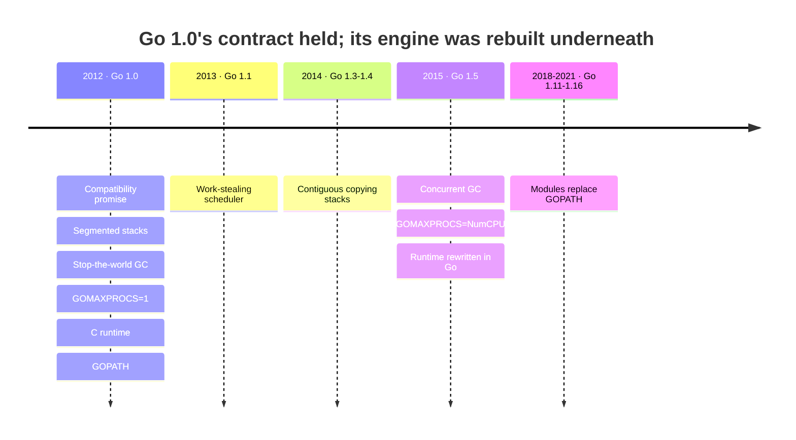

This is the first entry in a long project: reading every Go release in order — every minor version, every patch — the way you'd review a pull request years after it merged. Not "what's new," but what shipped, what it cost, and what it looks like with the benefit of knowing how the story ends. We start where Go itself decided to start counting.

## Dateline: March 28, 2012

On the morning of March 28, 2012, the Go team did the one thing they'd spent two and a half years not doing: they promised to stop changing the language.

Until then, writing Go meant aiming at a moving target. Releases came on two churning tracks — weekly snapshots tagged `weekly.2012-03-27` and numbered "stable" tags that ran `r56` through `r60` — and a breaking change landed with nearly every one. `r57` deleted the `closed()` builtin and redesigned the `reflect` package wholesale. `r58` changed the signature of `http.Client.Get` and reworked `os/exec`. `r59` restricted `goto` and changed struct-tag syntax. Each update could rename a type, move a package, or quietly alter a function under your feet.

The tool that made this survivable was `gofix`: a program that found code using the old APIs and rewrote it to the new ones. The workflow was a ritual — update Go, run `gofix`, read the diff it produced, run your tests, and hope. It worked, mostly. But "mostly" is a hard thing to build a company on, and the people evaluating Go in 2011 said so.

Go 1 was the answer, and the answer was not a feature. The [announcement](https://go.dev/blog/go1) put it plainly: *"The driving motivation for Go 1 is stability for its users."* The whole release is a single idea — break everything one last time, on purpose, and then never break it again.

## What Go 1 actually was

Because the goal was stability, the Go team used the 1.0 boundary to land, all at once, the backwards-incompatible cleanups they'd been designing for years. Ship them together, absorb the pain in one migration, and start the clock. The changes that went in at that boundary are worth knowing, because they defined what Go *is*:

- **The builtin `error` interface.** Pre-1.0 Go had an `os.Error` type and an `os.NewError` constructor. Go 1 removed them and made `error` a builtin — `type error interface { Error() string }` — with a new `errors` package beside it. `if err != nil` became the law of the land, and it has not moved since.
- **The `rune` type**, an alias for `int32`, so that a character literal like `'こ'` had an honest name instead of masquerading as an `int`.
- **The `delete` builtin** for maps, replacing the genuinely strange two-value assignment form `m[k] = value, false`.
- **A redesigned `time` package** — `time.Time` as a value, `time.Duration` as a typed nanosecond count — and a reorganized standard library, with packages moved into the hierarchy we still use: `net/http`, `encoding/json`, `os/exec`, `unicode/utf8`.
- **The `go` command.** This is the one people forget was new. Before 1.0, you built Go code with makefiles — `Make.pkg`, `Make.cmd`. Go 1 introduced `go build`, `go test`, `go get`, driven entirely by import paths, and *"does away with makefiles,"* as the release notes put it. It also introduced the `GOPATH` workspace as the way to lay out and resolve code. Hold that thought — of everything in this list, `GOPATH` is the only piece that aged badly, and we'll get there.

> [!NOTE]
> A lot of what people call "Go 1.0 features" predate it. Goroutines, channels, `gofmt`, and structural interfaces were all there before March 2012. Go 1's contribution wasn't inventing them — it was declaring them finished.

## The promise

The stabilization is the headline. The [compatibility document](https://go.dev/doc/go1compat) is the thing that mattered.

Its core sentence is deceptively small: programs written to the Go 1 specification *"will continue to compile and run correctly, unchanged, over the lifetime of that specification."*[^compat] Not "we'll try." Not "with a migration guide." Unchanged.

It carves out honest exceptions — security fixes, bugs in the spec, behavior that was never specified in the first place (map iteration order, the scheduling of goroutines), and a handful of named escape hatches like unkeyed struct literals. But within those lines, the guarantee is absolute, and it is a guarantee about *your* source code, not merely about the language on paper.

Why make a promise this expensive? Because in 2012 the thing standing between Go and adoption was not performance or syntax — it was trust. Nobody ports a production service to a language that rewrites itself every six weeks. The promise was a bet that stability would buy adoption, and that the price — never being able to remove or change anything in Go 1 again — was worth paying.

And it *is* a steep price. It means deprecation in Go has a peculiar definition: "documented as deprecated and left in place forever." It means an interface in the standard library can essentially never gain a method, because doing so would break every existing implementation — which is why `io.Reader` looks exactly as it did in 2012. New capability doesn't replace old capability; it arrives *beside* it. When the team wanted better errors, they didn't change the `error` interface — they added `errors.Is`, `errors.As`, and `%w` wrapping in Go 1.13. When they wanted a better `math/rand`, they shipped `math/rand/v2` as a whole new package rather than touch the old one.

Here's what that discipline looks like from the inside. This program uses only constructs that were legal Go in March 2012 — a one-method interface, a value-receiver method, the builtin `error`, goroutines over an unbuffered channel, `append`, `sort`. Press **Run**: it's executing on Go 1.26, fourteen years later, byte-for-byte unchanged.

```go run title="go1_promise.go"
package main

import (
	"errors"
	"fmt"
	"sort"
)

// Speaker is a one-method interface. Interfaces shipped before Go 1;
// Go 1 froze them in this shape.
type Speaker interface {
	Say() string
}

type greeting struct {
	lang, text string
}

func (g greeting) Say() string {
	return fmt.Sprintf("%s: %s", g.lang, g.text)
}

// verify returns the builtin error interface — the type Go 1 introduced
// to replace the pre-1.0 os.Error.
func verify(year int) error {
	if year < 2012 {
		return errors.New("before Go 1")
	}
	return nil
}

func main() {
	greetings := []greeting{
		{"en", "Hello"},
		{"es", "Hola"},
		{"ja", "こんにちは"},
		{"de", "Hallo"},
	}

	// Fan out: one goroutine per greeting, results over a channel.
	ch := make(chan string)
	for _, g := range greetings {
		go func(s Speaker) {
			ch <- s.Say()
		}(g)
	}

	out := []string{}
	for i := 0; i < len(greetings); i++ {
		out = append(out, <-ch)
	}
	sort.Strings(out) // deterministic, independent of goroutine order

	for _, line := range out {
		fmt.Println(line)
	}

	if err := verify(2012); err != nil {
		fmt.Println("error:", err)
	} else {
		fmt.Println("Go 1 compatibility: still compiling in 2026")
	}
}
```

```output
de: Hallo
en: Hello
es: Hola
ja: こんにちは
Go 1 compatibility: still compiling in 2026
```

The `verify` function is where the promise is visible. In 2011 you'd have written its signature against `os.Error`, and Go 1 would have forced you to change it exactly once — the last edit that line has ever needed:

```diff
-import "os"
+import "errors"

-func verify(year int) os.Error {
+func verify(year int) error {
 	if year < 2012 {
-		return os.NewError("before Go 1")
+		return errors.New("before Go 1")
 	}
 	return nil
 }
```

That single migration, multiplied across every package in the ecosystem, is what the whole industry paid to enter the Go 1 era. Nobody has had to pay it again.

## The engine underneath

Read the promise carefully and you notice what it *doesn't* cover: how any of this is implemented. That distinction — the contract is frozen, the machine underneath is not — is the most important thing to understand about Go 1.0, because the machine in 2012 was primitive, and almost every part of it has since been torn out and rebuilt while you weren't looking.

The Go you'd have run that March was, under the hood, nothing like the Go you run now:

- **Goroutine stacks were segmented.** A stack was a linked list of chunks; growing one meant allocating and linking another. A stack boundary that fell inside a hot loop paid the allocate-and-free cost on every iteration — the pathology the release notes for its eventual fix would call the "hot spot" problem, and which could cost an order of magnitude. Contiguous, copying stacks didn't arrive until **Go 1.3**.
- **The garbage collector was stop-the-world**, a plain mark-and-sweep whose pauses grew with your heap and were routinely measured in the hundreds of milliseconds. The concurrent collector — the one that promised pauses "almost always under 10 milliseconds" — is a **Go 1.5** story.
- **`GOMAXPROCS` defaulted to 1.** Out of the box, for the entire 1.0-through-1.4 era, a Go program ran your goroutines on a single OS thread. Parallelism across cores was something you opted into by hand. Go being parallel by default is, again, **Go 1.5**.
- **The scheduler had a single global run queue** behind a single lock, no per-processor queues and no work-stealing. The scalable G-M-P scheduler people think of as quintessentially Go was contributed in **Go 1.1**.
- **The compiler and runtime were substantially written in C.** A bespoke C compiler lived in the tree just to manage goroutine stacks. The rewrite that made Go self-hosting — *"the compiler and runtime are now written entirely in Go (with a little assembler)"* — is **Go 1.5** again.

None of that leaked into your code. A program that fanned out goroutines in 2012 fans them out identically today; only the thing catching them changed, from a single-threaded naive scheduler to a work-stealing one to whatever the runtime does this year. That invisibility is the compatibility promise paying dividends. It is also, conveniently, the map for this entire series — most of the interesting runtime engineering in Go's history is the story of replacing 1.0's implementation without disturbing 1.0's contract.

## In hindsight

Fourteen years and twenty-five minor releases later, the verdict on Go 1.0 sorts cleanly along one line: **what the release exposed as a contract survived; what it hid as implementation got replaced.**

Everything Go 1 turned into a promise is still standing. The compatibility guarantee itself has held — and rather than erode it, the team engineered *around* it. Go 1.21 formalized the `GODEBUG` mechanism so that behavioral changes ship off-by-default and are tied to the `go` version in your `go.mod`; update your toolchain and nothing changes until you update that line. The boldest test came in **Go 1.22**, which made loop variables per-iteration — a change to *language semantics* that would ordinarily be a flat violation of "run correctly, unchanged." They squared it with the promise using that same version gate: old code keeps its old meaning, the new behavior applies only to modules that declare `go 1.22`. That's the moment the strategy graduated from "freeze the language" to "evolve it safely, one module opt-in at a time." Which is why, when asked whether there will ever be a Go 2 that breaks Go 1 programs, Russ Cox's answer was simply: *never.* Generics and every other "Go 2" idea shipped inside Go 1, additively, because the promise left no other door.

The rest of the survivors are the things you'd guess: error-as-value (challenged directly by the `try` proposal in 2019, which was rejected specifically to keep the 1.0 model); the `go` tool's command surface; goroutines, channels, and `select`; the shape of the standard library and its core interfaces; and one small, perfect decision — **map iteration order randomization**. Go 1 deliberately made map iteration random because programmers had started depending on the old order, and depended-upon behavior ossifies. Forcing randomness kept the runtime free to change its hash tables — which is exactly what let the team drop in Swiss Tables maps in **Go 1.24** with nobody's code breaking. A tiny act of foresight, vindicated a decade later.

And then there's the one that aged worst.



**`GOPATH` is the exception that proves the rule.** A single global workspace, every dependency at whatever HEAD happened to be, no versioning and no reproducible builds. It was praised for its simplicity in 2012 and it spawned a decade of third-party tools trying to paper over its gaps — `godep`, `glide`, `dep`. It was finally replaced by modules: experimental in **Go 1.11**, default in **Go 1.16**. Notice *why* it needed a visible, multi-release migration when stacks and the GC got swapped in silence: `GOPATH` was the one part of 1.0 exposed as a user-facing workflow rather than hidden as implementation. The compatibility promise protects contracts. `GOPATH` was a contract, so fixing it cost real disruption. Every other flaw in this article, the promise let them fix for free.

## The point releases

Go 1.0's line saw three maintenance releases in 2012, and — in the spirit of covering every release — they're worth naming, though each gets its own closer look later in this series:

- **go1.0.1** (April 25, 2012) fixed an escape-analysis bug that could lead to memory corruption. A compiler analysis getting a lifetime wrong badly enough to corrupt memory is exactly the kind of foundational fix a brand-new language rushes out — and it's a reminder that "1.0" meant "stable API," not "finished implementation."
- **go1.0.2** (June 13, 2012) fixed two bugs in maps keyed by structs or arrays.
- **go1.0.3** (September 21, 2012) was minor code and documentation fixes.

Three patches, no security releases, no regressions — a quiet first line for a release whose whole point was to be boring.

## Scorecard

The fixed rubric this series carries through every episode, judged in hindsight:

| Dimension | Rating | Why |
|---|---|---|
| Language impact | 5/5 | It *is* the language. Every later release is defined relative to this baseline. |
| Runtime / perf impact | 2/5 | The 2012 runtime was primitive by design; its real performance story is everything that replaced it. |
| Ecosystem disruption | 5/5 | The last intentional break — one migration the whole ecosystem paid, so it would never pay again. |
| Longevity | 5/5 | The contract is untouched fourteen years on; the promise aged better than anything else in Go. |
| Patch-line turbulence | 1/5 | Three quiet point releases, one memory-corruption fix, no CVEs. |

Go 1.0's genius wasn't in what it added — the interesting features were years away. It was the decision to draw a line and hold it, and to hold it by hiding the whole machine behind a contract narrow enough to keep and rebuild everything behind. Fourteen years of runtime engineering happened on the other side of that line without a single one of us having to care. That's the promise. The rest of this series is what it bought.

[^compat]: *Go 1 and the Future of Go Programs*, [go.dev/doc/go1compat](https://go.dev/doc/go1compat). The companion release notes are at [go.dev/doc/go1](https://go.dev/doc/go1), and the announcement at [go.dev/blog/go1](https://go.dev/blog/go1).
