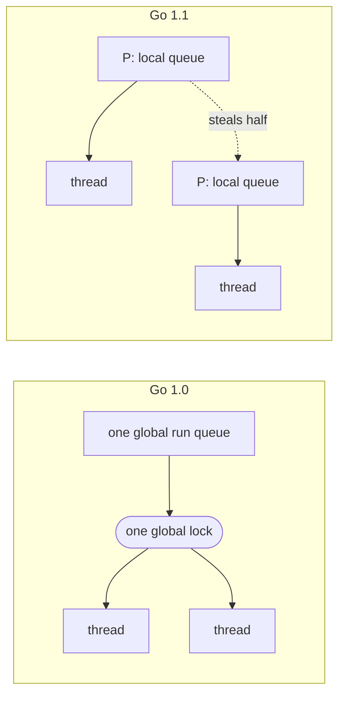

Go 1.1 shipped on 13 May 2013, thirteen months after Go 1. Read its release notes looking for language changes and there is almost nothing: a few small additions, no removals, nothing you were forced to fix. The compatibility promise from a year earlier held, and the surface of the language stayed where it was.

The change was all underneath. Recompile a Go 1.0 program with the 1.1 toolchain, no edits, and it ran about a third faster. The scheduler had been rebuilt, the garbage collector made precise, the compiler taught to emit better code. And the toolchain could now do something the 1.0 toolchain could not do at all: watch a running program and tell you where two goroutines were touching the same memory without synchronization.

That figure is the Go team's, reported in 2013, and I checked it myself. The runnable cells later in the piece cannot help there: the playground fakes its clock, and the speedup lives in the compiler and the runtime rather than in a line you could edit. The timing in this piece comes from real hardware instead, and the cells carry what is left, a new tool and some sharper edges on the language.

## The dividend

The release notes state the performance claim directly:[^relnotes]

> The performance of code compiled with the Go 1.1 gc tool suite should be noticeably better for most Go programs. Typical improvements relative to Go 1.0 seem to be about 30%-40%, sometimes much more, but occasionally less or even non-existent.

The gains came from several places at once. The compiler inlined more, including small operations like `append` and interface conversions that had been function calls. The map implementation was rewritten to use less memory and less CPU. The runtime and the network library were coupled more tightly, so network operations caused fewer trips through the scheduler. None of it touched the language. A program written to the Go 1 spec got faster by being handed to a newer compiler, with no source change.

I did not want to take that on faith, so I put it on a clock. I built the 1.0 and 1.1 compilers from their `go1` and `go1.1` source tags and ran the same benchmark file through each, natively and back to back, on one idle machine.[^bench] Recompiling the Go 1 code with the newer toolchain, with no edit to the source, moved almost all of it:

```
host   msa2-client, AMD Ryzen 9 9955HX (16 cores / 32 threads), Ubuntu 26.04, linux/amd64
build  go1 and go1.1 built from source, each compiling the same benchmark file
setup  GOMAXPROCS=1, pinned to one core, median of 5 runs, ns/op

benchmark               go 1.0      go 1.1   speedup
BinaryTree             437,681     443,659     0.99x
Fannkuch             1,766,521   1,486,956     1.19x
Mandelbrot             284,911     188,919     1.51x
FmtFprintfInt             94.1        66.6     1.41x
FmtFprintfString           118        64.2     1.84x
AppendBytes              2,970       3,431     0.87x
MapAssignInt              39.1        25.7     1.52x
MapAccessInt              36.1        15.5     2.33x
GobEncode                1,658       1,057     1.57x
JSONMarshal              7,180       3,849     1.87x
RegexpMatch                673         658     1.02x
SortInts               228,520     138,671     1.65x
InterfaceCall              518         310     1.67x
Gzip                   270,253     255,145     1.06x

geometric mean                                 1.41x
```

No single number captures it. The map read came out more than twice as fast. Formatting, JSON, gob, and sort came in between 40 and 90 percent faster. The regexp match and the gzip pass moved by only a few percent. Two came out slower on 1.1: the binary-tree allocation walk by a hair, and appending to a byte slice by about fifteen percent. The geometric mean is 1.41, and the individual results run from more than double to a real loss, which is the release notes' own hedge measured out: "sometimes much more, but occasionally less or even non-existent."

## The engine that moved

The largest single change was the scheduler. In Go 1.0 every goroutine in a program lived on one global run queue, and the runtime guarded that queue with one global lock. Creating a goroutine took the lock. Choosing the next goroutine to run took the lock. Entering and leaving a system call took the lock. On a single core none of that mattered. On several it was the ceiling: the threads meant to do the work spent their time waiting to touch the one queue.

Go 1.1 replaced it with the G, M, P model. A goroutine is a G. An operating-system thread is an M. The new piece is P, a processor, meaning a scheduling context rather than a physical core, and there are exactly `GOMAXPROCS` of them. A thread must hold a P to run Go code. Each P carries its own local run queue, so creating and picking goroutines became a local operation with no global lock on the common path. When a P's queue empties, it pulls from the global queue, and if that is empty too, it steals about half the runnable goroutines from another P chosen at random. Dmitry Vyukov wrote both the design and the implementation, in a document called the "Scalable Go Scheduler Design Doc."[^sched]



One thing this did not change is the default. `GOMAXPROCS` still defaulted to 1 in Go 1.1, the same as in 1.0, so out of the box a program still ran its goroutines through a single P. The rewrite let the runtime scale across cores, but `GOMAXPROCS` still had to be raised by hand to use more than one P.

You can measure the rewrite once you raise it. I ran a workload built to lean on the scheduler, sixty-four short-lived goroutines per iteration, each doing a little arithmetic and reporting back over a channel, on both toolchains with `GOMAXPROCS` set to 8:

```
host   msa2-client, AMD Ryzen 9 9955HX (16C/32T), Ubuntu 26.04, linux/amd64
setup  64 goroutines per op, native build, median of 5 runs, ns/op

            GOMAXPROCS=1    GOMAXPROCS=8
go 1.0            20,319          33,924
go 1.1            21,422          15,577
```

On one P the two are within a few percent. At eight they separate. Go 1.1 drops from 21.4 to 15.6 microseconds, because the goroutines spread across per-P queues that take no shared lock on the common path. Go 1.0 goes the other way, from 20.3 up to 33.9: every scheduling step still passes through the one global lock, so more threads buy more contention. On this workload at eight cores the 1.1 scheduler ran 2.18 times faster than 1.0.

The garbage collector changed in a quieter way. Go 1.0's collector was conservative about pointers: shown a word that might be an address, it kept whatever that word pointed at alive, to be safe. Go 1.1 made the collector precise for values on the heap. It knew which words in a heap object were real pointers and which were plain integers, so a stray number that happened to look like an address could no longer keep dead memory from being reclaimed. The heap footprint fell, and it fell hard on 32-bit systems, where an integer and an address are the same width and the guessing was worst.[^relnotes]

## A bug the old tool could not see

The visible addition was a tool. With the `-race` flag, the Go 1.1 toolchain instruments every memory access a program makes and reports, at run time, when two goroutines reach the same variable with no synchronization between them and at least one is writing. It is built on ThreadSanitizer, the same detector used for C and C++.[^race]

Here is the smallest program that has a race. Two goroutines write one variable with nothing ordering them:

```go
package main

import "fmt"

func main() {
	done := make(chan bool)
	count := 0
	go func() {
		count++ // write in a second goroutine
		done <- true
	}()
	count++ // write in the main goroutine, with nothing ordering the two
	<-done
	fmt.Println(count)
}
```

On Go 1.0 you cannot even ask the question, because the flag does not exist:

```
$ go version
go version go1
$ go run -race race.go
flag provided but not defined: -race
usage: run [build flags] gofiles... [arguments...]
```

On Go 1.1, built from source and run with the flag, the toolchain finds it:[^repro]

```
$ go version
go version go1.1
$ go run -race race.go
==================
WARNING: DATA RACE
Write by goroutine 4:
  main.func·001()
      /tmp/race.go:9 +0x40

Previous write by goroutine 1:
  main.main()
      /tmp/race.go:12 +0x115
==================
Found 1 data race(s)
exit status 66
```

Two writes to `count`, one from the goroutine at line 9 and one from `main` at line 12, with no channel or lock ordering them, and the detector names both. It checks correctness, and says nothing about speed. The bug it catches is the kind that survives every reading of the code, because whether it corrupts anything depends on timing that changes from run to run, and a tool that watches every access does not depend on catching the bad interleaving live. It reasons about which accesses could overlap at all. Shipping it in 1.1 put a correctness tool for concurrency in the standard toolchain.

The playground cannot run `-race`, so those two transcripts are recorded rather than live cells.[^repro]

## Sharper edges

The language did change, in small and additive ways. Two of them you can run here.

Go 1.0 let you take a method as a value in only one form, the method expression, which takes the receiver as an explicit first argument. Go 1.1 added the method value: bind the receiver in, and you get a plain function.

```go run title="methodvalue.go"
package main

import "fmt"

type greeter struct{ name string }

func (g greeter) hello() string { return "hello, " + g.name }

func main() {
	g := greeter{"world"}
	say := g.hello // a method value: the receiver g is bound in
	fmt.Println(say())
}
```

```output
hello, world
```

In Go 1.1, `g.hello` is a `func() string` closed over `g`, and you can store it and call it later. On Go 1.0 the same line does not compile:

```
$ go run methodvalue.go
./methodvalue.go:11: method g.hello is not an expression, must be called
```

The other change you can feel is the width of `int`. On a 64-bit machine, Go 1.0's `int` was 32 bits; Go 1.1's is 64.

```go run title="intsize.go"
package main

import (
	"fmt"
	"unsafe"
)

func main() {
	fmt.Println("int is", unsafe.Sizeof(int(0))*8, "bits")
}
```

```output
int is 64 bits
```

On a 64-bit build it prints 64. Go 1.0 printed 32, and a constant too large for a 32-bit `int` was an error there but compiles in 1.1:

```
$ go run intsize.go        # Go 1.0
int is 32 bits
$ go run big.go            # Go 1.0, with: var n int = 1 << 40
./big.go:6: constant 1099511627776 overflows int
```

The wider `int` raised the ceilings that came with it. A slice could now hold more than two billion elements, and the heap could grow from a few gigabytes into the tens.[^relnotes] The remaining language changes were smaller: dividing by a constant zero became a compile error instead of a run-time panic, a function whose final statement is an infinite loop no longer needed a trailing `return`, and Unicode surrogate halves were rejected as rune and string constants. None of them broke code that already compiled.

## What the year bought

Go 1.1 is the first release where the compatibility promise paid out. A year earlier the team had frozen the language and accepted the cost that came with it, that no mistake in the Go 1 API could ever be removed. The freeze bought the freedom to change everything below the language: the scheduler and the collector rebuilt, the compiler's output improved, all of it handed back as a recompile that ran a third faster and could now find a program's races.[^points]

[^relnotes]: [Go 1.1 Release Notes](https://go.dev/doc/go1.1), the source for the 13 May 2013 release, the performance claim (quoted verbatim), the inlining and map and network improvements, the precise garbage collector, the 64-bit `int` on 64-bit platforms and its effect on slice and heap sizes, and the language changes.
[^bench]: The performance figures come from msa2-client, one node of my benchmarking cluster: an AMD Ryzen 9 9955HX (16 cores, 32 threads, up to 5.06 GHz) running Ubuntu 26.04 on Linux 7.0, linux/amd64. I built both compilers from the `go1` and `go1.1` source tags and ran them natively on that machine, not under emulation, so the timing is real. Each figure is the median of five runs of one second each; the single-thread suite ran at `GOMAXPROCS=1` pinned to one core, and the scheduler workload at `GOMAXPROCS=8`. The identical benchmark file was compiled by each toolchain, and speedup is the Go 1.0 time divided by the Go 1.1 time. The suite is `bench_test.go`, alongside this article.
[^sched]: Dmitry Vyukov, "Scalable Go Scheduler Design Doc," which lays out the Go 1.0 single-global-lock, single-run-queue scheduler as the problem and the G-M-P work-stealing model as the fix; Vyukov wrote both the document and the Go 1.1 implementation. `GOMAXPROCS` is the number of P's; it defaulted to 1 in both Go 1.0 and Go 1.1.
[^race]: The race detector was introduced in Go 1.1, enabled with the `-race` build flag, and is built on ThreadSanitizer. See "Introducing the Go Race Detector," Dmitry Vyukov and Andrew Gerrand, 2013.
[^repro]: Both transcripts are recorded from toolchains built from the `go1` and `go1.1` source tags and run natively on msa2-client, the same machine as the benchmarks. Go 1.1's 2013 race runtime is written in C, and on a 2026 host it links only after its C toolchain is told to drop position-independent code and the newer relocation types the old linker cannot read. The report here is trimmed to the two conflicting writes; the full output also prints the runtime frames and where each goroutine was created, and the goroutine numbers, the addresses, and which write is called "previous" can vary between runs and machines. The Go Playground does not support `-race`, so this cannot be a live cell.
[^points]: Two point releases followed, go1.1.1 (13 June 2013) and go1.1.2 (13 August 2013), each a bag of compiler and runtime fixes.
