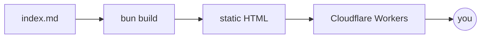

This site just went through a complete rebuild, and this article doubles as its living documentation: every feature the engine supports appears somewhere on this page. The [raw Markdown source](index.md) of this page is served alongside it, so it's also the reference for how each block is written.

## Typography and prose

Long-form text is set in Newsreader with a 70-character measure — the sweet spot for sustained reading. Inline styles work as expected: **bold**, *italic*, ~~strikethrough~~, `inline code`, and [links](https://developer.mozilla.org/). Keyboard keys render like <kbd>Ctrl</kbd>+<kbd>K</kbd>.

> Regular blockquotes still look like this. Good for quoting people who said smart things.

Lists, of course:

1. Ordered lists for sequences
2. With proper spacing
   - And nested unordered items
   - That align cleanly

| Feature | Build-time | Client JS |
|---|---|---|
| Syntax highlighting | Shiki | none |
| Math | KaTeX | none |
| Diagrams | — | Mermaid (lazy) |
| Running code | — | on demand |

## Callouts

> [!NOTE]
> Five callout types are supported, using GitHub's blockquote syntax — so they degrade gracefully anywhere else markdown is rendered.

> [!TIP]
> Use `hl={3-5}` on a code fence to highlight lines three through five.

> [!WARNING]
> The Go snippets on this page execute on the public Go Playground via a proxy. Don't paste secrets into things you run.

## Footnotes

Footnotes get proper references[^1] with backlinks, and they can contain multiple sentences[^2].

[^1]: Like this one. Click the arrow to jump back.
[^2]: This footnote has two sentences. It exists to prove multi-sentence footnotes render correctly.

## Code blocks

Code blocks get a header with an optional filename, a language badge, and a copy button. Highlighted lines use fence metadata:

```go title="greet.go" hl={5}
package main

import "fmt"

func greet(name string) string {
	return fmt.Sprintf("Hello, %s!", name)
}

func main() {
	fmt.Println(greet("world"))
}
```

Diffs work with the `diff` language:

```diff
-const theme = localStorage.getItem('theme') || 'light';
+const theme = localStorage.getItem('theme'); // null = follow the system
```

## Runnable code

This is the fun part. Blocks marked `run` get a **Run** button. Go programs execute on the official Go Playground (proxied through this site's Worker), and the playground's event timing is preserved — watch the goroutines interleave:

```go run title="goroutines.go"
package main

import (
	"fmt"
	"time"
)

func worker(id int, done chan<- string) {
	time.Sleep(time.Duration(id) * 300 * time.Millisecond)
	done <- fmt.Sprintf("worker %d finished", id)
}

func main() {
	done := make(chan string)
	for i := 1; i <= 3; i++ {
		go worker(i, done)
	}
	for i := 0; i < 3; i++ {
		fmt.Println(<-done)
	}
}
```

```output
worker 1 finished
worker 2 finished
worker 3 finished
```

SQL runs entirely in your browser — a fresh in-memory SQLite database every time, courtesy of WebAssembly. No server involved:

```sql run
CREATE TABLE langs (name TEXT, born INTEGER, systems BOOLEAN);

INSERT INTO langs VALUES
  ('Go',   2009, 1),
  ('Rust', 2010, 1),
  ('SQL',  1974, 0),
  ('Zig',  2016, 1);

SELECT name, born FROM langs
WHERE systems = 1
ORDER BY born;
```

```output
name  born
----  ----
Go    2009
Rust  2010
Zig   2016
```

JavaScript runs in a sandboxed Web Worker with a five-second watchdog:

```js run
const fib = (n) => n < 2 ? n : fib(n - 1) + fib(n - 2);

for (let i = 10; i <= 14; i++) {
  console.log(`fib(${i}) = ${fib(i)}`);
}
```

The static block under each runnable snippet is pre-recorded output — it is what you see if JavaScript is off or the playground is unreachable, and the live output replaces it when you hit Run.

## Math

Inline math like $O(n \log n)$ flows with the text. Display math gets its own block:

$$
\int_{-\infty}^{\infty} e^{-x^2}\,dx = \sqrt{\pi}
$$

All rendered at build time — your browser downloads no math JavaScript.

## Diagrams

Mermaid diagrams are rendered client-side, lazily, and follow the site theme:



## Media

Images become proper figures with lazy loading and a lightbox — click to zoom:


YouTube embeds are click-to-load facades: nothing is fetched from Google until you press play.

::youtube{id=dQw4w9WgXcQ title="A historically significant video."}

## Publishing mechanics

A few things you can't see on this page:

- **Scheduled publishing** — an article dated in the future is skipped at build time; the daily rebuild publishes it when its day comes.
- **Drafts** — `draft: true` keeps an article out of every build unless you pass `--drafts`.
- **Archiving** — set `archived: 2027-01-01` and the article gains an archived banner on that date.
- **Series** — this article belongs to the *Blog Engine* series; the navigation below appears automatically.

That's the tour. The [source](https://github.com/FumingPower3925/albertbf) is public — steal anything you like.
