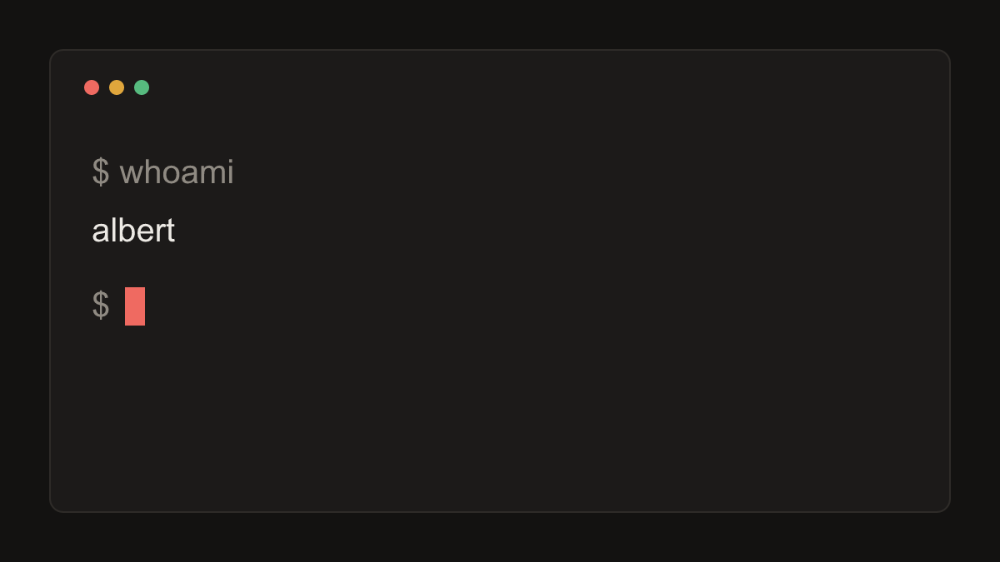

This site just went through a complete rebuild, and this article also documents it: every feature the engine supports appears somewhere on this page. The [raw Markdown source](index.md) of this page is served alongside it, so it's also the reference for how each block is written.

## Typography and prose

Long-form text is set in Newsreader with a 70-character measure. Inline styles work as expected: **bold**, *italic*, ~~strikethrough~~, `inline code`, and [links](https://developer.mozilla.org/). Keyboard keys render like <kbd>Ctrl</kbd>+<kbd>K</kbd>.

> Regular blockquotes still look like this. Good for quoting people who said smart things.

Lists work too:

1. Ordered lists for sequences
2. With proper spacing
   - And nested unordered items
   - That align cleanly

| Feature | Build-time | Client JS |
|---|---|---|
| Syntax highlighting | Shiki | none |
| Math | KaTeX | none |
| Diagrams | dagre + SVG | none |
| Charts and tables | SVG + HTML | none |
| Running code | none | on demand |

## Callouts

> [!NOTE]
> Five callout types are supported, using GitHub's blockquote syntax. They degrade gracefully anywhere else markdown is rendered.

> [!TIP]
> Use `hl={3-5}` on a code fence to highlight lines three through five.

> [!IMPORTANT]
> Runnable blocks need complete programs: a Go snippet must be a full `package main`.

> [!WARNING]
> The Go snippets on this page execute on the public Go Playground via a proxy. Don't paste secrets into things you run.

> [!CAUTION]
> JavaScript you run executes in your own browser (sandboxed in a Web Worker). Only run code you understand.

## Footnotes

Footnotes get proper references[^1] with backlinks, and they can contain multiple sentences[^2].

[^1]: Like this one. Click the arrow to jump back.
[^2]: This footnote has two sentences. It exists to prove multi-sentence footnotes render correctly.

## Code blocks

Code blocks get a header with an optional filename, a language badge, and a copy button. Highlighted lines use fence metadata:

```go title="greet.go" hl={5}
package main

import "fmt"

func greet(name string) string {
	return fmt.Sprintf("Hello, %s!", name)
}

func main() {
	fmt.Println(greet("world"))
}
```

Diffs work with the `diff` language:

```diff
-const theme = localStorage.getItem('theme') || 'light';
+const theme = localStorage.getItem('theme'); // null = follow the system
```

## Runnable code

This is the fun part. Blocks marked `run` get a **Run** button. Go programs execute on the official Go Playground (proxied through this site's Worker), and the playground's event timing is preserved. Watch the goroutines interleave:

```go run title="goroutines.go"
package main

import (
	"fmt"
	"time"
)

func worker(id int, done chan<- string) {
	time.Sleep(time.Duration(id) * 300 * time.Millisecond)
	done <- fmt.Sprintf("worker %d finished", id)
}

func main() {
	done := make(chan string)
	for i := 1; i <= 3; i++ {
		go worker(i, done)
	}
	for i := 0; i < 3; i++ {
		fmt.Println(<-done)
	}
}
```

```output
worker 1 finished
worker 2 finished
worker 3 finished
```

SQL runs entirely in your browser, on a fresh in-memory SQLite database, courtesy of WebAssembly. No server involved:

```sql run title="languages.sql"
CREATE TABLE langs (name TEXT, born INTEGER, systems BOOLEAN);

INSERT INTO langs VALUES
  ('Go',   2009, 1),
  ('Rust', 2010, 1),
  ('SQL',  1974, 0),
  ('Zig',  2016, 1);

SELECT name, born FROM langs
WHERE systems = 1
ORDER BY born;
```

```output
name  born
----  ----
Go    2009
Rust  2010
Zig   2016
```

A block can also draw on data that ships beside the article. When a fence names a `.sql` file with `db=`, the engine runs that file before the block. This page carries one, `seed.sql`:

```sql title="seed.sql"
CREATE TABLE elements (number INTEGER, symbol TEXT, name TEXT);

INSERT INTO elements (number, symbol, name) VALUES
  (1, 'H',  'Hydrogen'),
  (2, 'He', 'Helium'),
  (3, 'Li', 'Lithium'),
  (4, 'Be', 'Beryllium'),
  (5, 'B',  'Boron');
```

So the query below runs against a table that already exists:

```sql run title="periodic.sql" db=seed.sql
SELECT number, symbol, name
FROM elements
ORDER BY number;
```

```output
-- loaded seed.sql

number  symbol  name
------  ------  ---------
1       H       Hydrogen
2       He      Helium
3       Li      Lithium
4       Be      Beryllium
5       B       Boron
```

A script works for a handful of rows. For anything bigger, ship a SQLite file instead. `status.sqlite`, also next to this page, is one such file. It holds a single `http_status(code, phrase)` table, and a fence pointed at it opens the database directly, no script step:

```sql run title="http.sql" db=status.sqlite
SELECT code, phrase
FROM http_status
WHERE code >= 500
ORDER BY code;
```

```output
-- opened status.sqlite

code  phrase
----  --------------------------
500   Internal Server Error
501   Not Implemented
502   Bad Gateway
503   Service Unavailable
504   Gateway Timeout
505   HTTP Version Not Supported
```

And with `db=@shared`, every SQL block on the page talks to one database, so a walkthrough can build it up in stages. This block fills a table:

```sql run title="stash.sql" db=@shared
CREATE TABLE stash (word TEXT);
INSERT INTO stash VALUES ('mise'), ('en'), ('place');
```

```output
3 row(s) modified
```

…and this one, further down the page, still sees what the last one left behind:

```sql run title="recall.sql" db=@shared
SELECT group_concat(word, ' ') AS assembled FROM stash;
```

```output
assembled
-------------
mise en place
```

JavaScript runs in a sandboxed Web Worker with a five-second watchdog:

```js run title="fib.js"
const fib = (n) => n < 2 ? n : fib(n - 1) + fib(n - 2);

for (let i = 10; i <= 14; i++) {
  console.log(`fib(${i}) = ${fib(i)}`);
}
```

Top-level `await` works, and anything that resolves after it still lands in the output:

```js run title="await.js"
const wait = (ms) => new Promise((resolve) => setTimeout(resolve, ms));

console.log("working…");
await wait(400);
console.log("…and back, 400ms later");
```

```output
working…
…and back, 400ms later
```

The static block under each runnable snippet is pre-recorded output. It is what you see if JavaScript is off or the playground is unreachable, and the live output replaces it when you hit Run.

## Math

Inline math like $O(n \log n)$ flows with the text. Display math gets its own block:

$$
\int_{-\infty}^{\infty} e^{-x^2}\,dx = \sqrt{\pi}
$$

All rendered at build time. Your browser downloads no math JavaScript.

## Diagrams

Diagrams are laid out with dagre and rendered to SVG at build time, so they ship no JavaScript and still follow the site theme:

```diagram
dir: LR
md: index.md
build: bun build
dist: static HTML
cf: Cloudflare Workers
you (circle, accent): you
md -> build -> dist -> cf -> you
```

## Charts and tables

Benchmark data gets structures of its own, all rendered at build time to SVG or plain HTML. There is no charting library and no client JavaScript, and they follow the theme like everything else.

A bar chart takes a list of labels and values. A `baseline` draws a reference line and greys out the bars that fall short of it:

```chart
title: Speedup after an optimization pass
unit: x
baseline: 1
sort: desc
note: Bars past the dashed line got faster; the one below got slower.
Parser: 2.1
Router: 1.6
Template: 1.35
Logger: 1.05
Serializer: 0.9
```

A data table right-aligns its numeric columns with tabular figures and can single out one of them. Add a `collapse` line and it folds away behind a summary, so a long breakdown stays out of the way until someone wants it:

```table
collapse: Full latency breakdown, 6 endpoints
caption: Numeric columns are monospace with tabular figures; the p99 column is highlighted.
highlight: p99
cols: endpoint | p50 (ms) | p99 (ms) | req/s
GET /articles | 1.2 | 4.8 | 9,400
GET /feed.xml | 0.9 | 3.1 | 2,100
GET /tags/go | 1.1 | 4.2 | 3,800
POST /api/run | 12.4 | 48.0 | 320
GET /sitemap.xml | 0.7 | 2.4 | 640
GET / | 1.0 | 3.6 | 7,200
```

A matrix is a grid whose numeric cells shade by value, for reading a comparison across two axes at a glance:

```matrix
title: Cache hit rate by tier and region (percent)
cols: Edge, Regional, Origin
US: 98, 82, 40
EU: 96, 79, 38
APAC: 91, 71, 44
```

## Media

Images become proper figures with lazy loading and a lightbox. Click to zoom:



YouTube embeds are click-to-load facades: nothing is fetched from Google until you press play.

::youtube{id=dQw4w9WgXcQ title="A historically significant video."}

## Sharing and tags

Every article carries a **Share** button beneath its title. It hands off to your device's share sheet where there is one, and copies the link everywhere else. Nothing is loaded from anyone else to make that work. The tags under the title are links as well: each opens a page collecting everything filed under it.

## Publishing mechanics

A few things you can't see on this page. An article dated in the future is skipped at build time, and the daily rebuild publishes it when its day comes. A file with `draft: true` stays out of every build unless you pass `--drafts`. Set `archived: 2027-01-01` and the article gains an archived banner on that date. Add `series: <slug>`, declared in `series.yaml`, and the article joins that series, with automatic prev/next navigation between its entries.

That's the tour. The [source](https://github.com/FumingPower3925/albertbf) is public. Steal anything you like.
