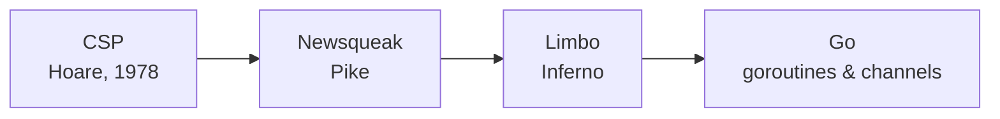

A language doesn't begin at 1.0. It begins on a whiteboard. And Go's whiteboard predates its first stable release by four and a half years. Long before there was anything to version, there was a design, three people, and a specific set of frustrations they set out to engineer their way past. This is where Go actually starts.

## The whiteboard

On September 21, 2007, three engineers at Google started sketching the goals for a new language on a whiteboard.[^faq] That is not a colorful retelling. It's the first line of Go's official history, and the Go team has always dated the language to that afternoon rather than to any release.

The three were Robert Griesemer, Rob Pike, and Ken Thompson. Whatever else you want to say about Go, it was not a language designed by people learning on the job.

> [!NOTE]
> You will often read that Go was born while its authors waited 45 minutes for a C++ binary to build. That's close to the truth but not quite it. Pike, who tells the story, is careful about the distinction. He calls it *"the origin myth for Go,"* and the build in question was *"a major Google binary"* that *"took 45 minutes using a precursor distributed build system."*[^splash] The C++ part is the reader's inference, filled in from the surrounding complaint about header bloat. The frustration was real; the tidy anecdote is, in Pike's own word, a myth.

## The people who showed up

Who sat at that whiteboard explains a great deal about the language that came off it.

**Ken Thompson** co-created Unix at Bell Labs, wrote the B language that C descends from, worked on Plan 9, and (with Pike) designed UTF-8, the encoding this page is served in. He has a Turing Award. In January 2008 he wrote Go's first compiler; it emitted C.[^faq]

**Rob Pike** was also Bell Labs and Plan 9, and the other half of UTF-8. More to the point, he had spent twenty years building a specific lineage of concurrent languages (Newsqueak, then Limbo) that is the direct ancestor of the way Go does concurrency. We'll come back to that.

**Robert Griesemer** had worked on Google's V8 JavaScript engine, and before that on Java's HotSpot compiler and the Strongtalk system. He is the reason the language has a compiler team's sensibility about what is cheap and what is not.

This is a story about three people who had already built the tools other people's languages were built on, sitting down to build one for themselves.

## What they were running from

Go was, in Pike's framing, designed *"in the service of software engineering"*.[^splash] The point was never language theory for its own sake. It answered specific pain at Google's scale: codebases of tens of millions of lines, worked on by thousands of engineers, with build times that had *"stretched to many minutes, even hours."*[^splash]

The stated goals were unglamorous and, in hindsight, exactly right:

- **Compilation should feel instant.** The 2009 launch note promised that *"even large binaries compile in just a few seconds."*
- **The language should be small.** No header files, no forward declarations, and *"everything is declared exactly once."* No type hierarchy: *"types just are."*[^faq]
- **Concurrency should be first-class**, because multicore had arrived and the mainstream languages treated threads as an afterthought.
- **Memory should be managed for you**, because you cannot write large concurrent programs and also track every allocation by hand.

There was a subtler motivation underneath all of that. The team had watched capable engineers drift from C++ toward Python and JavaScript. They traded away performance and safety for the simple relief of not fighting the language.[^faq] Go was an attempt to make them stop having to choose: the ease of a dynamic language with the efficiency and safety of a compiled, statically typed one.

## Where it came from

Go did not spring from nowhere, and it's least original in exactly the places people assume it's most novel.

The syntax is C family. The declarations and package structure come from the Pascal / Modula / Oberon side of the family. And the concurrency (the goroutines and channels everyone associates with Go) descends from Tony Hoare's *Communicating Sequential Processes*, published in 1978, by way of the languages Pike spent two decades building.[^faq]



The one idea Go carried down this line, the thing that separates it from vanilla CSP, is that **a channel is a first-class value.** You can store one in a variable, pass it to a function, and return it from a function. That sounds obvious now; it wasn't. It's the move that lets you write concurrency as ordinary code instead of as a special construct bolted onto the side of the language.

Here it is, in Go you can run today. A function that returns a channel, which a 1985 CSP dialect would have recognized:

```go run title="lineage.go"
package main

import "fmt"

// count returns a channel, a first-class value. That idea reached Go
// from Newsqueak, by way of Limbo, out of Hoare's CSP.
func count(to int) <-chan int {
	ch := make(chan int)
	go func() {
		for i := 1; i <= to; i++ {
			ch <- i
		}
		close(ch)
	}()
	return ch
}

func main() {
	for n := range count(5) {
		fmt.Println(n)
	}
}
```

```output
1
2
3
4
5
```

That program is younger than the idea it demonstrates by about thirty years. This is a recurring theme in Go: the parts that feel modern are usually old, chosen deliberately, and the newness is in the restraint.

## Going public

For two years, Go was a private project. Ken's C-emitting compiler came in January 2008. By the middle of that year it was a full-time effort with a real compiler. In May 2008, Ian Lance Taylor (a GCC maintainer who had simply read the draft spec) emailed the team to say he was building a *second*, independent compiler front end, `gccgo`; having two implementations from one specification is the kind of thing that quietly validates a design. Russ Cox joined in late 2008 and did much of the work of turning a prototype into something real.[^faq]

Then, on November 10, 2009, Go became a public open-source project.[^faq] The announcement went out on Google's open-source blog under the title *"Hey! Ho! Let's Go!"* Builds were instant, the concurrency was strange and wonderful, and the whole thing shipped with a mascot: a bucktoothed gopher drawn by Renée French, adapted from a design she'd made years earlier for a New Jersey radio station. The gopher is a distant cousin of Glenda, the Plan 9 bunny.[^gopher]

## The other Go

Not everyone was delighted. The day after launch, a developer named Francis McCabe opened [issue #9](https://github.com/golang/go/issues/9) with a title that is hard to improve on: *"I have already used the name for MY programming language."* He had, in fact. An agent-oriented language called Go!, in the Prolog tradition, with academic papers to its name.[^issue9]

It looked nothing like the language that took it. Algebraic types, functions, and logical relations shared a single object:[^goexcl]

```go!
Sex ::= male | female.

person(Nm, Born, Sx, Hm)..{
  age() => yearsBetween(now(), Born).
  sex() => Sx.
  lives(Pl) :- Pl = home().
}.
```

The `=>` defines a function; the `:-` is a Prolog-style rule. You were never going to confuse *that* with a systems language, which is roughly what Google argued. The issue stayed open for eleven months and was closed in October 2010 with the status *"Unfortunate"* and a note that, since launch, *"there has been minimal confusion of the two languages."* True enough, and also exactly the answer you'd expect from the side that had Google behind it. On GitHub the thread survives, frozen due to age, a small monument to the one fight Go didn't design its way out of.

## What wasn't settled

By the end of 2009 Go was public, fast, open source, and had a gopher. What it did *not* have was any promise that the program you wrote this week would still compile next week.

Almost nothing was settled. The standard library was a sketch. Builtins would appear and vanish. Whole packages were redesigned, renamed, and moved. The syntax itself was still moving. For the next two and a half years, using Go meant treating breakage as a routine cost of doing business. Living through that is exactly what would make a promise of stability, once it finally arrived, feel less like a feature than a rescue.

[^faq]: All conception and timeline facts here are quoted from the official [Go FAQ, "History"](https://go.dev/doc/faq#history): the September 21, 2007 whiteboard session, the January 2008 C-emitting compiler, the May 2008 `gccgo` front end, Russ Cox joining in late 2008, and the November 10, 2009 open-source release.
[^splash]: Rob Pike, [*Go at Google: Language Design in the Service of Software Engineering*](https://go.dev/talks/2012/splash.article) (SPLASH 2012), the source for the "origin myth," the build-time figures, and the software-engineering thesis.
[^gopher]: Renée French, [*The Go gopher*](https://go.dev/blog/gopher), on the mascot's origins and its lineage from the WFMU gopher and Plan 9's Glenda.
[^issue9]: golang/go issue #9, *"I have already used the name for MY programming language"*, filed by Francis McCabe the day after launch and closed in October 2010.
[^goexcl]: The Go! fragment is drawn from the [Go! programming language](https://en.wikipedia.org/wiki/Go!_%28programming_language%29) article; the language was introduced by Francis McCabe and Keith Clark around 2003.
